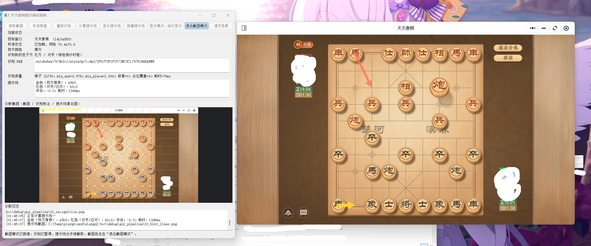
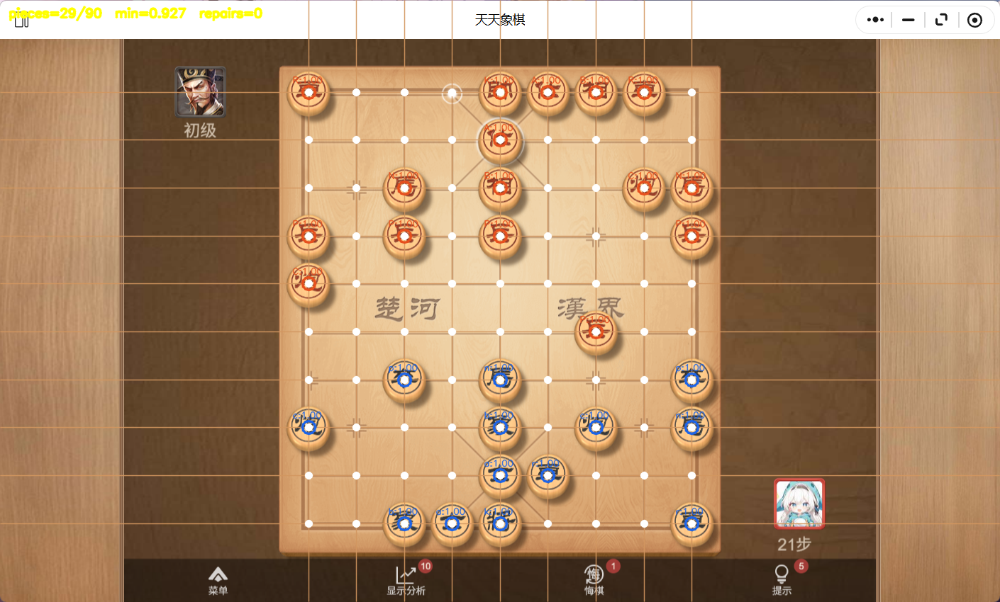
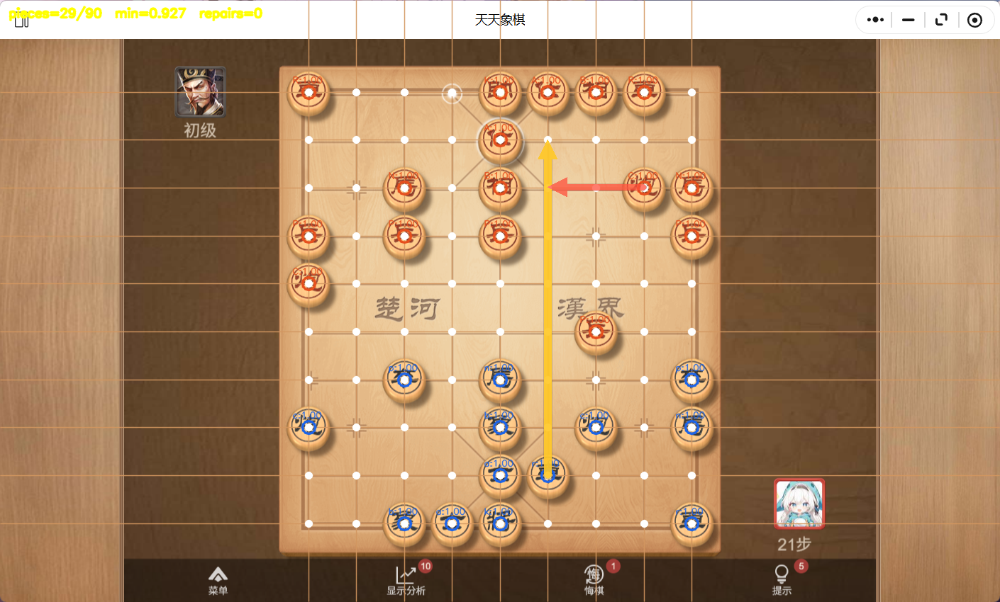

# 象棋走法学习助手（Windows）

通过 CNN 识别天天象棋棋盘，调用 Pikafish（皮卡鱼）分析局面，在棋盘上绘制双方推荐走法。提供 Qt 图形界面，支持我方执红或执黑，以及中局、残局识别。

本项目用于**在实战中学习象棋走法，以及测试和天天象棋的人机对打**。走子由用户手动完成。**后续不会实现自动点击、自动下棋、自动开局等功能。**

## 效果示例

总体效果展示：



识别棋子与网格（历史诊断截图，白点为网格交点，字母为识别类别）：



推荐走法（历史诊断复合图，实际悬浮层只绘制提示线）：



图片中的天天象棋界面及美术资源归其权利人所有，作为功能展示，不属于本项目代码许可授权范围。

## 安装

适用平台：Windows 10 / 11 桌面环境。开发使用 Python 3.12；其他 Python 版本须有对应的 PyQt5、PyTorch 安装包。支持多显示器，GPU 可选，CPU 也可运行。

在项目根目录打开 PowerShell：

```powershell
python -m venv .venv
.\.venv\Scripts\python.exe -m pip install -r requirements.txt
```

依赖未锁定精确版本，并不意味着所有版本组合都经过验证。需要 NVIDIA GPU 加速时，请按照 [PyTorch 官方安装指引](https://pytorch.org/get-started/locally/) 安装互相匹配的 torch、torchvision 和 CUDA 构建；没有可用 CUDA 时使用 CPU。

### 准备皮卡鱼引擎

从 [Pikafish 官方 Releases](https://github.com/official-pikafish/Pikafish/releases) 下载适合你的 Windows CPU 指令集的版本，以及该版本配套的 NNUE 文件。将它们放在项目根目录：

```text
xiangqi-hint/
├── win_hint_gui.py
├── pikafish.exe
├── pikafish.nnue
└── xiangqi_cnn.pt
```

将所选引擎可执行文件命名为 `pikafish.exe`，配套网络命名为 `pikafish.nnue`。不要混用不同引擎版本要求的网络。CNN 权重 `xiangqi_cnn.pt` 随本项目提供；皮卡鱼程序与 NNUE 不纳入本仓库。

### 启动 GUI

```powershell
.\.venv\Scripts\python.exe -X utf8 win_hint_gui.py
```

已有依赖的环境也可直接运行 `python -X utf8 win_hint_gui.py`。Qt 插件环境变量会在启动时指向当前 Python 环境的 PyQt5 插件目录。

## 使用流程

1. 打开天天象棋的人机棋盘，确保棋盘完整可见。
2. 点击一次 **校准棋盘**。校准后自动识别、分析和更新提示线，正常走子无需点击其他按钮。
3. 移动或缩放窗口后，松开窗口，再点击 **校准棋盘**。
4. 重开、切换局面或识别有误时点击 **重新识别**；网格位置不正确则重新校准。
5. 结束使用时关闭 GUI，程序会等待当前操作结束并释放引擎和悬浮层。

我方始终位于棋盘下方。绿色头像倒计时框指示当前走子方；未识别到绿色框时默认我方走。请结合面板中的“我方颜色”和“识别到的走子方”核对结果。

- 黄线：当前走子方的最佳走法。
- 红线：另一方随后应对。
- 我方回合：黄线为我方最佳走法，红线为对方随后应对。
- 对方回合：黄线为对方最佳走法，红线为我方随后应对。

面板 FEN 为引擎使用的规范化编码（我方统一大写），实际红黑请看颜色标签，不要仅凭 FEN 大小写判断。

### 显示、遮挡与截图

| 按钮 | 行为 |
| --- | --- |
| 显示模式：始终显示 | 遮挡时保留已有线条，暂停识别；解除遮挡后恢复更新 |
| 显示模式：仅前台 | 游戏不在前台时隐藏线条 |
| 隐藏提示线 / 显示提示线 | 暂停自动更新 / 核验当前局面后恢复 |
| 进入截图模式 | 暂停识别，取消悬浮层的截图排除，方便系统或聊天软件截图 |
| 退出截图模式 | 恢复之前的运行状态，重新识别当前局面 |
| 抓取截图 | 保存用于检查校准的目标窗口截图 |

普通模式的悬浮层会被 Windows 排除出截图，避免箭头干扰 CNN；截图前先进入截图模式，等面板显示“已就绪”。**截图模式下的棋盘、回合和提示均为暂停时的快照，不会随游戏更新。** 遮挡时保留的线条也不是实时建议。

## 最新 CNN（2026-09-12）

仓库中的 `xiangqi_cnn.pt` 已更新为基于实际对局采集数据微调的模型。用户实测反馈：大多数场景已能稳定识别；这不是对所有皮肤、动画或缩放的准确率保证。重启 GUI 即可加载新权重，无需重新训练。

- 使用人工确认的开局标签，以及模板匹配与视觉模型一致的标签：训练 2,560 个裁片，按对局划分验证 968 个；6,125 个疑难裁片保留未标注，不强行用于训练。
- 验证裁片错误从 2/968 降为 0/968；独立人工历史中局/残局 180 格仍全部正确，最低置信度由 0.728 提升至 0.999；±3 像素偏移检查错误从 2/720 降为 1/720。
- 本机 RTX 4070 Laptop GPU 微调 30 轮，训练本体约 8.36 秒，按验证结果选择候选。离线样本存在筛选偏差，不能把零验证错误当作实战 100% 准确率；模型仍可能高置信度误判，也不能替代准确的棋盘校准。

训练脚本、评估限制及本地备份回滚方法见 [TRAINING.md](TRAINING.md)。**仓库仅包含部署权重和脚本，不包含约 1.4 GB 原始采集图、裁片或训练运行目录**；这些都位于被 Git 忽略的 `datasets/` 下。标注脚本从本机配置读取凭据，凭据不随仓库发布。

## 限制与排查

- 棋盘皮肤、动画、选中效果和窗口缩放仍可能影响识别；不承诺所有布局或每一步都在固定时间内完成。
- 出现“棋盘不可信”：等待走子动画结束，检查诊断网格是否覆盖棋子中心，必要时重新校准。新校准需要通过识别验证后才会保存。
- 没有提示线：检查是否处于暂停、截图模式、窗口移动等待校准或仅前台模式。
- 走子方错误：检查绿色框及面板状态；退出截图模式后再重新识别。
- 引擎启动失败：检查两个皮卡鱼文件是否齐全、版本是否配套、CPU 指令集是否支持。
- 诊断输出保存至 `debug/`；提交问题前检查截图，移除头像、昵称、路径等不希望公开的信息。

## 开发与目录

- `win_hint_gui.py`：推荐入口，GUI、校准和自动更新调度。
- `win_hint.py`：Windows 识别与分析逻辑，以及可选命令行提示入口。
- `win32_screen.py` / `win32_overlay.py`：窗口截图和点击穿透悬浮层。
- `board_geometry.py` / `gui_pipeline.py`：网格拟合和诊断绘图。
- `xiangqi_bot.py` / `xiangqi_cnn.py` / `xiangqi_cnn.pt`：上游派生的识别基础、CNN 和权重；旧 Bot 自动对局入口已禁用。
- `engine_session.py`：Pikafish UCI 子进程管理。
- `test_gui_automatic.py`：无实机点击的回归检查。
- `debug_gui_pipeline.py`：按阶段检查截图、识别及提示，仅供诊断。

```powershell
.\.venv\Scripts\python.exe -m unittest test_gui_automatic -v
```

`calib.json`、`debug/`、缓存、训练数据和本地归档均不提交。工作区中的 `_local_archive/` 仅用于保存整理前的旧脚本和旧 Git 元数据，不属于发布内容。

## 来源与许可证

本项目以 **GPL-3.0-only** 发布，许可全文见 [LICENSE](LICENSE)。使用外部 GPL 引擎并不意味着任何通过进程通信的前端都必然必须采用 GPL；本项目主动选择 GPL v3 发布。

**CNN 模型、预训练权重及部分识别基础代码来自 [yingwang/xiangqi-bot](https://github.com/yingwang/xiangqi-bot)**，上游声明为 MIT。本项目在其基础上修改了 Windows 捕获、校准、识别稳定性、回合判断及 GUI。上游 MIT 版权和许可全文保留在 [LICENSES/xiangqi-bot-MIT.txt](LICENSES/xiangqi-bot-MIT.txt)，不是仅以链接代替许可声明。详细归属见 [THIRD_PARTY_NOTICES.md](THIRD_PARTY_NOTICES.md)。

[Pikafish](https://github.com/official-pikafish/Pikafish) 为 GPL v3 引擎，本项目通过 UCI 子进程调用。引擎二进制和 NNUE 由用户从官方获取。如另行制作包含它们的发布包，须一并处理对应版本完整源代码及许可证的分发要求，不能仅凭本项目的 LICENSE 代替。
## 数据采集

- 点击“开始数据采集”，与人机正常对弈，结束后点击“停止数据采集”。
  不需要校准或识别成功；采集期间暂停自动提示并隐藏悬浮线，窗口需无遮挡。
  原始全窗口 PNG 和 `frames.jsonl` 保存在 `datasets/raw/日期时间/`，不会提交 Git。
  目标采样率约 8 FPS（受截图和写盘速度影响）；按中央棋盘区域去除精确及近似重复，
  保留明显的走子、吃子、选中和动画变化。去重是启发式，不能保证所有细微动画均被保存。
  单次最多约 10GB，可用磁盘不足 1GB 时停止。建议每局单独启停一次。
  数据尚未标注，不能直接训练；动画帧需要单独标注/筛选，不能套用稳定局面的棋子标签。
  后续训练集与验证集应按整局或采集会话划分，避免相邻帧泄漏。图片可能包含头像、昵称，分享前请检查。
